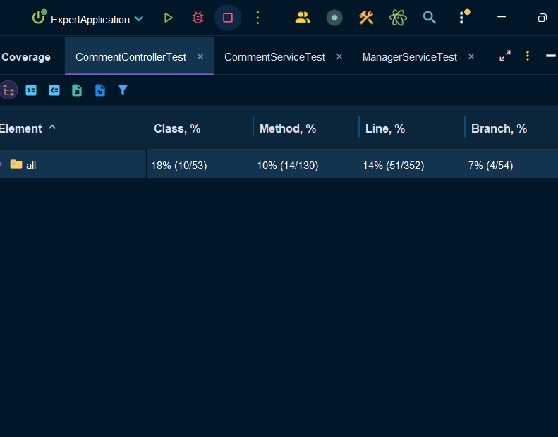

# 스프링 심화 과제

### 0. 목차

[1. 개발환경](#1-개발환경) 
[2. 요구사항](#2-요구사항) 
[3. 도전기능](#3-도전기능) 
[4. 테스트 커버리지](#4-테스트-커버리지) 
[5. 주요 commit](#5-주요-commit)

### 1. 개발환경

+ JDK Amazon Corretto 17.0.13
+ Spring Framework Boot 3.3.3
+ Spring Web 6.1.12
+ Gradle 8.11.1
+ Jsonwebtoken 0.11.5
+ Slf4j 2.0.16
+ Jakarta Annotation 2.1.1
+ Apache Tomcat Embed 10.1.28
+ Hibernate validator 8.0.1
+ Jackson Bom 2.17.2
+ Bcrypt 0.10.2

### 2. 요구사항

#### Lv 1. 코드 개선

1-1 AuthService 클래스에 있는 signup() 리팩토링

1-2 WeatherClient 클래스에 있는 getTodayWeather() 리팩토링

1-3 UserService 클래스에 있는 changePassword() 개선

#### Lv 2. N+1 문제

현재 TodoRepository에서 JPQL을 작성하여 fetch join을 사용 중 
이를 @EntityGraph를 사용하도록 변경하여 N+1 문제를 해결하도록 코드를 수정할 것

#### Lv 3. 테스트코드 연습

3-1 matches_메서드가_정상적으로_동작한다() 테스트가 의도대로 성공할 수 있게 수정

3-2 manager_목록_조회_시_Todo가_없다면_NPE_에러를_던진다() 테스트가 성공하고 컨텍스트와 일치하도록 테스트 코드와 테스트 코드 메서드 명을 수정

3-3 comment_등록_중_할일을_찾지_못해_에러가_발생한다() 테스트가 성공할 수 있도록 테스트 코드를 수정

### 3. 도전기능

#### Lv 4. Interceptor 또는 AOP를 활용한 API 로깅

어드민 사용자만 접근할 수 있는 특정 API에는 접근할 때마다 접근 로그를 기록

+ 관리자 권한의 사용자만 접근할 수 있는 메서드
CommentAdminController 클래스의 deleteComment() 
UserAdminController 클래스의 changeUserRole()

**세부 구현 가이드** 

Interceptor 
- 어드민 인증 여부를 확인
- 인증되지 않은 경우 예외를 발생시킬것 

AOP 

- `@Around` 어노테이션을 사용하여 어드민 API 메서드 실행 전후에 요청/응답 데이터를 로깅
- 요청 본문과 응답 본문은 JSON 형식으로 기록
- 로깅은 `Logger` 클래스를 활용하여 기록

### 4. 테스트 커버리지

### 5. 주요 commit

1. [1-1 Early Return](#https://github.com/Hokirby/spring-advanced/commit/50fd80c1a28f7dbdd28d386375e7b303fac6776b) 
[1-2 avoid if-else](#https://github.com/Hokirby/spring-advanced/commit/8382c95e1dbe0cdb530df200969a011ea9e896e4) 
[1-3 validation](#https://github.com/Hokirby/spring-advanced/commit/3c9297f41ce216be128cee0358de223e3ba287c2)

2. [2 resolve N+1 error](#https://github.com/Hokirby/spring-advanced/commit/4f0aab619d5f7c343eb6138813c37c79128dc827)

3. [3-1 correct test code error](#https://github.com/Hokirby/spring-advanced/commit/3a77522be9cfe867b1bed57d29f7708e1840b0d0) 
[3-2-1 correct test code error](#https://github.com/Hokirby/spring-advanced/commit/e1e21751bb86e6297c78f52459fbf7c37b93de14) 
[3-2-2 correct test code error](#https://github.com/Hokirby/spring-advanced/commit/1a01607b35107bd3c016cc721938013020dd3345) 
[3-2-3 correct test code error](#https://github.com/Hokirby/spring-advanced/commit/3836cfc404c3f65da8f6987c95b1d1dccb5692bf)

4. [4 add intercepter with API logging](#https://github.com/Hokirby/spring-advanced/commit/8509abe9f78ebce08ef5659211a3faaa9c5bc1f0) 
[4 remove duplicate path resolution logic](#https://github.com/Hokirby/spring-advanced/commit/c076ea002a9e56e3351bd6581cc327e3ba84c43c)

5. [5 inject AuthUserArgumentResolver dependency](#https://github.com/Hokirby/spring-advanced/commit/a89ad141fc094b67ea0b2d18f1b72d9bdfe3d439) 
[5. refactor](#https://github.com/Hokirby/spring-advanced/commit/175b9348c90a75bff50c71aed7e8d6a22146e417)

6. [6 add test code for membership and login functions](#https://github.com/Hokirby/spring-advanced/commit/0169ee20038249646920716f3996c25abdd8f0de)
